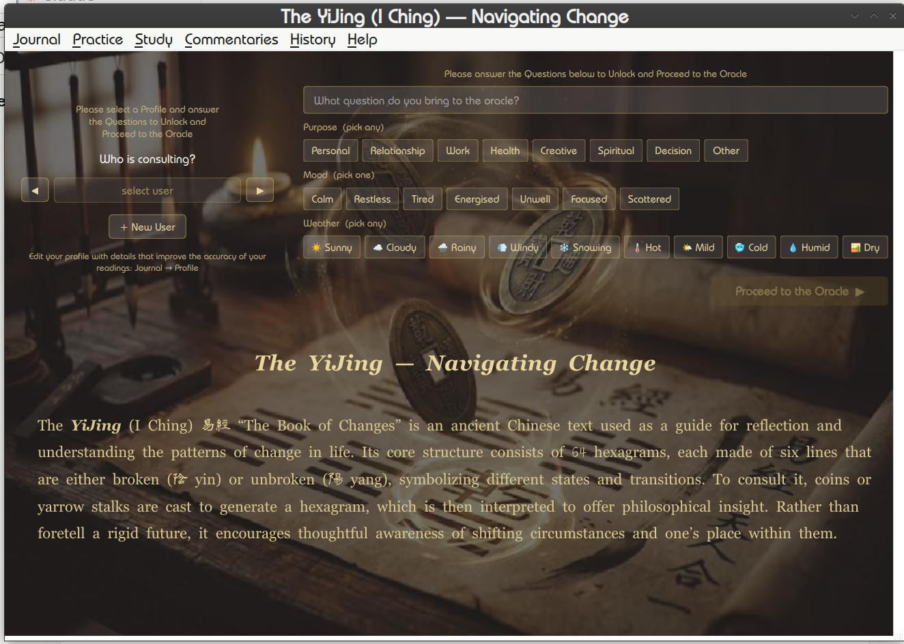
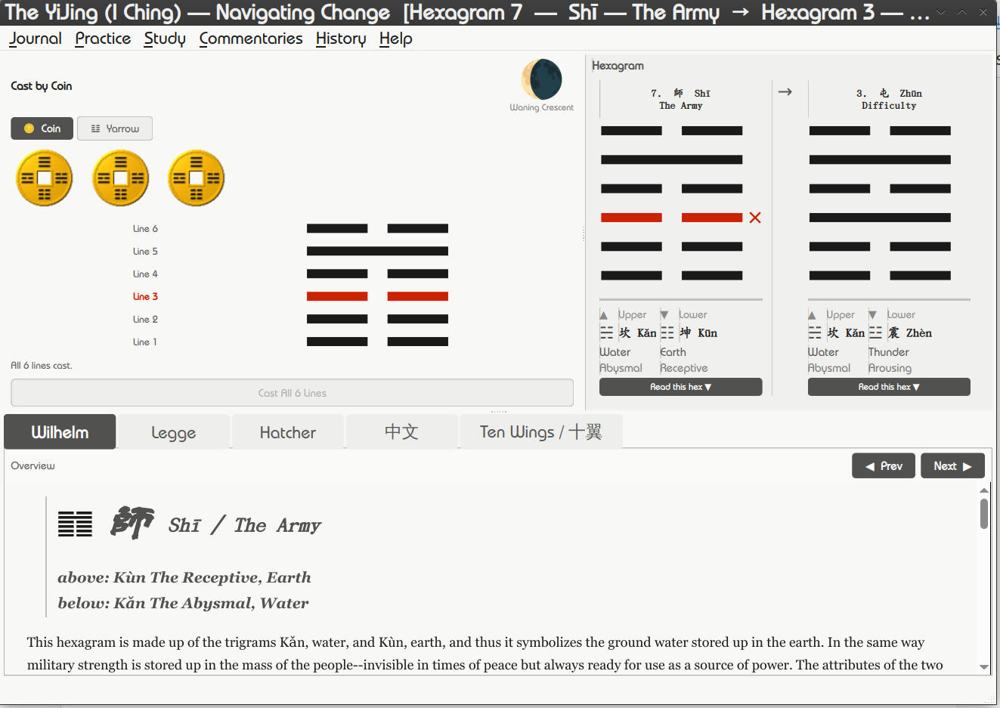
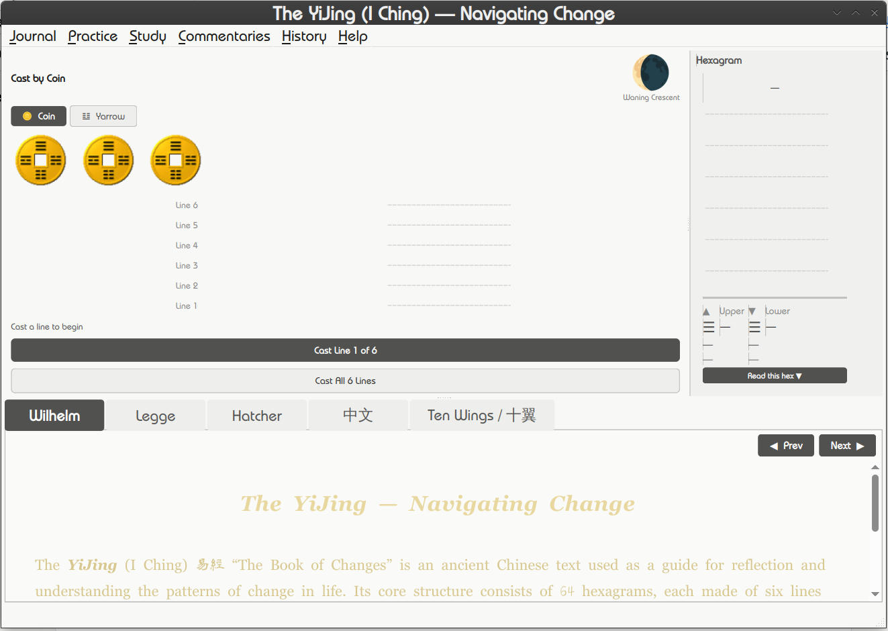

# The YiJing (I Ching) — Navigating Change

A desktop oracle for consulting the YiJing (I Ching) — 易經, "The Book of Changes" —
Cast a hexagram by coin or yarrow stalk, read it across five sources —
three classic translations, the original Chinese text, and the Ten Wings —
and keep a private reading journal — all in one offline Linux application.

**Version:** 1.0
**Flatpak ID:** `io.archerprojects.YiJingNavigatingChange`
**Platform:** Linux (Flatpak) · X11 · x86_64
**Developer:** archerprojects — <archer.projects@proton.me> · GitHub [@archerprojects](https://github.com/archerprojects)
**Licence:** GPL-3.0-or-later (see [`LICENSE`](LICENSE) and [Credits & Licensing](#credits--licensing))

---

## Purpose

The YiJing is an ancient Chinese text used as a guide for reflection on change.
Its structure is 64 hexagrams, each built from six lines that are either broken
(yin) or unbroken (yang). A question is brought to the oracle, a hexagram is cast,
and the result — together with any moving lines and the hexagram it changes into —
is read for insight.

*Navigating Change* makes that process self-contained and unhurried: it casts
authentically, presents the reading clearly, and records it, without needing a
network connection or any external service.

## Features

- **Two casting methods.** Coin toss (every line type equally likely) and the older
  yarrow-stalk method, which weights the lines unequally (Old Yin is rare — 1 in 16).
  The yarrow cast is animated stalk by stalk.
- **Manual cast entry.** Enter a hexagram by hand when you have cast off-screen.
- **Five reading sources.** Richard Wilhelm (tr. Cary F. Baynes), James Legge, and
  Bradford Hatcher — plus the original Chinese text (中文) of the Zhouyi and the
  Ten Wings (十翼) commentaries in Chinese with Legge's translation — switchable
  per reading, with a full book reader panel.
- **Primary and relating hexagrams.** Moving lines and the resulting hexagram are
  shown side by side, with upper/lower trigram detail.
- **Reading journal.** Per-profile entries capturing the question, purpose, mood,
  weather, moon phase, and the cast result.
- **Trigram lookup and study.** Browse all 64 hexagrams and the eight trigrams.
  The study section also carries the five Ten Wings treatises complete — the
  Great Treatise I & II (繫辭), the Discussion of the Trigrams (說卦), the Sequence
  (序卦), and the Hexagrams in Irregular Order (雜卦) — bilingually.
- **Profiles.** Multiple consulting profiles, plus a Guest mode that does not journal.

## Screenshots





---

## Architecture

The application is built with **Python 3 / PySide6** (Qt for Python). Translation
texts and the book reader are rendered as HTML through **QWebEngineView**. Coins,
yarrow stalks, and hexagram figures are drawn with **QPainter**. Reading data is
stored locally per profile.

### Source layout

| File | Responsibility |
|---|---|
| `yijing_main.py` | Main window, layout and mode switching, `HexDisplay`, hex-panel sizing, reading flow. Holds the app-identity block (`APP_NAME`, `APP_VER`, `APP_ID`) — the single source of truth for version and ID. |
| `cast.py` | Cast panel and coin engine: `CastPanel`, coin cast panel, `CoinWidget`, `LineWidget`, coin-image loader. |
| `yarrow_animation.py` | Yarrow panel and animated stalk-sorting widget. |
| `coin_images.py` | Base64-encoded cash-coin animation frames. |
| `journal.py` | Reading journal, profiles, entry storage, moon-phase calculation. |
| `hexfig.py` | SVG hexagram-figure injection into book HTML. |
| `widgets.py` | `ZoomView` (a `QWebEngineView` subclass) used by the reader. |
| `build.sh` | Generic build script. Reads version and app ID from `yijing_main.py`; produces the PyInstaller bundle and the Flatpak. |

### Runtime assets

The following assets are bundled into the Flatpak at build time and are **required to
build a working application**:

- `book/`, `content/` — reader sources (Wilhelm, Legge, Hatcher, 中文, Ten Wings) and study content
- `opening_image.png`, `opening_image_wo_text.png`, `swirl.png` — artwork
- `ukai_yijing.ttf` — AR PL UKai CN subset (CJK body text)
- `aoyagi_yijing.ttf` — Aoyagi Reisho SIMO subset (clerical-script headings); its
  author's distribution documents accompany it and must remain in the repository
- `icon_64.png`, `icon_128.png`, `icon_256.png` — application icons

> **Note for contributors:** assets live alongside the source in this repository.
> If you obtain the source without the `book/`, `content/`, font, and image assets,
> the build will complete but the application will be missing its translations,
> artwork, and CJK font.

---

## Building

### Prerequisites

- **Python 3.12**
- **PySide6** (Qt 6, including QtWebEngine)
- **PyInstaller 6.20** or newer
- **flatpak** and **flatpak-builder**
- The **freedesktop runtime and SDK 25.08**:

  ```sh
  flatpak install flathub org.freedesktop.Platform//25.08 org.freedesktop.Sdk//25.08
  ```

### Build and install

From the project directory:

```sh
rm -rf dist build *.spec && ./build.sh
```

`build.sh` reads the version and Flatpak ID directly from `yijing_main.py`, runs
PyInstaller, packages the Flatpak (`YiJingNavigatingChange-<version>-x86_64.flatpak`),
and installs it. No paths or version numbers are hardcoded in the script — bumping
`APP_VER` in `yijing_main.py` is the only change needed to version a release.

### Run

After installation:

```sh
flatpak run io.archerprojects.YiJingNavigatingChange
```

---

## Credits & Licensing

*The YiJing — Navigating Change* is a Python/PySide6 reimagining that builds on
earlier free-software work and public-domain scholarship. It is released under the
**GNU General Public License, version 3 or later** (GPL-3.0-or-later). The full
licence text is in [`LICENSE`](LICENSE).

| Contributor | Work | Licence |
|---|---|---|
| Jean Pierre Charalambos | iching-0.2 original (2002) | GPL-2.0 |
| Stephen M. Gava | pyChing coin engine + animation | GPL-2.0 |
| Richard Wilhelm | Translation (1923), tr. Cary F. Baynes | Public domain |
| James Legge | Translation (1899); Ten Wings translation (1882) | Public domain |
| Bradford Hatcher | Translation (2009), hermetica.info | Free |
| Arphic Technology | AR PL UKai CN font | Arphic Public License |
| 青柳衡山 (Aoyagi Kouzan) / SIMO | Aoyagi Reisho SIMO font (headings) | Free for any use (author's terms; docs bundled) |
| — | Zhouyi base text, 卦辭/爻辭 (Chinese Wikisource & ctext.org, pulled 2026-06) | Public domain |
| — | Ten Wings 十翼, Chinese text (ctext.org, pulled 2026-06) | Public domain |
| rjv | Python/PySide6 port, redesign, content (2026) | GPL-3.0 |

The coin animation frames in `coin_images.py` are the original pyChing image data by
Stephen M. Gava and retain their GPL-2.0 attribution; the casting logic has been
rewritten for this project. All components above are licensed under GPL-compatible
terms, and the combined work is distributed under GPL-3.0-or-later.

---

## Disclaimer

This program comes with ABSOLUTELY NO WARRANTY. It is free software, and you are
welcome to redistribute it under the conditions of the GNU General Public License.
The YiJing is offered here as a tool for reflection, not prediction.
